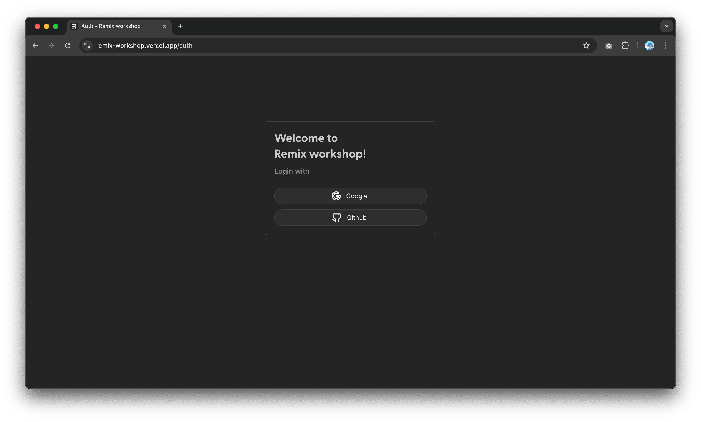
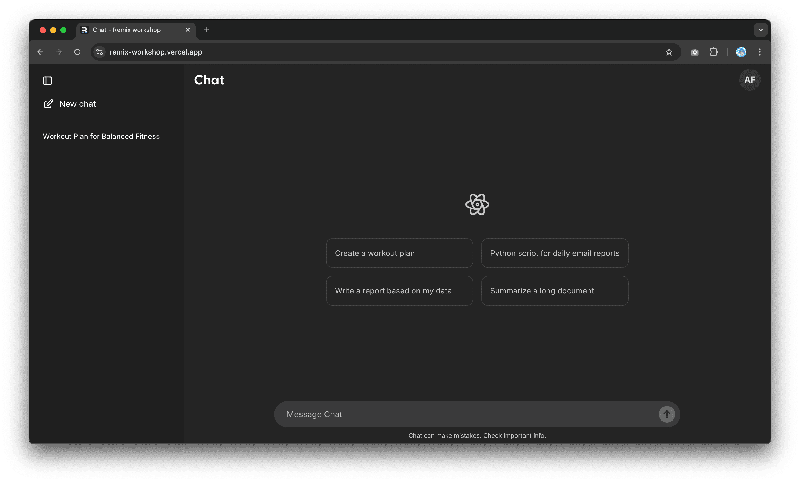
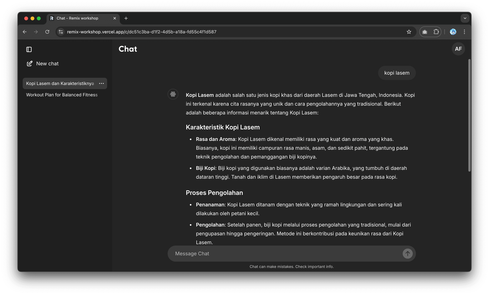
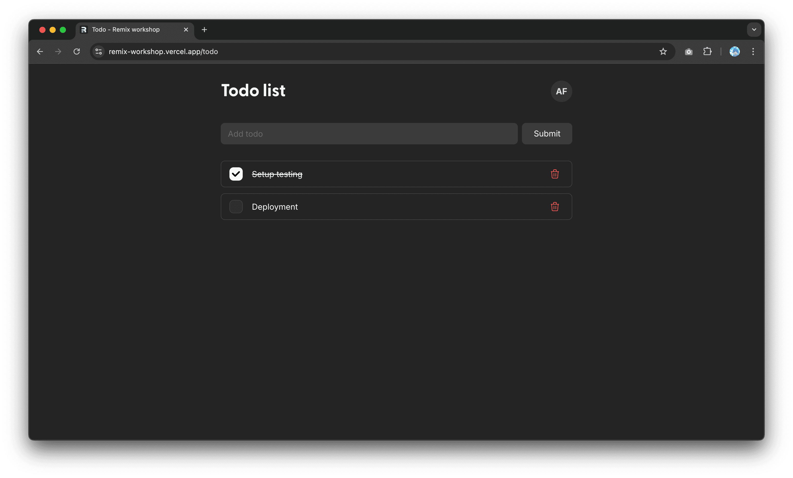

# Remix-workshop Project

This project is built with [Remix](https://remix.run/), a full stack web framework that lets you focus on the user interface and work back through web fundamentals to deliver a fast, slick, and resilient user experience.

## 🛠️ Tech Stack

- **Framework**: [Remix](https://remix.run/)
- **UI/Styling**: 
  - [Tailwind CSS](https://tailwindcss.com/)
  - [Mantine UI](https://mantine.dev/)
  - [Tabler Icons](https://tabler.io/icons) for pixel-perfect, customizable icons
- **Database**: 
  - [Prisma](https://www.prisma.io/) (ORM)
  - [PostgreSQL](https://www.postgresql.org/)
- **Authentication**: [Lucia](https://lucia-auth.com/) with Google and GitHub providers
- **Testing**: [Playwright](https://playwright.dev/) for end-to-end testing
- **AI Integration**: [OpenAI gpt-4o-mini](https://openai.com/gpt-4) for advanced natural language processing


## 📸 Screenshots

Here are some screenshots showcasing the key features of our application:

<p float="left">
  
  
  
  
</p>


## 🚀 Quick Start

### Prerequisites

- Node.js (version 20 or later recommended)
- npm (comes with Node.js)

### Environment Setup

Before installation, you need to set up your environment variables:

1. Copy the example environment file:
   ```sh
   cp .env.example .env
   ```

2. Open the newly created `.env` file and modify the values as needed

3. Ensure that `.env` is listed in your `.gitignore` file to keep your secrets safe.


### Installation

1. Clone the repository:
   ```sh
   git clone git@github.com:adnanfajlur/remix-workshop.git
   cd remix-workshop
   ```

2. Install dependencies:
   ```sh
   npm install
   ```

3. Run the setup script:
   ```sh
   npm run setup
   ```

## 🛠️ Development

To run the development server:

```sh
npm run dev
```

This will start the app in development mode. Open [http://localhost:3000](http://localhost:3000) to view it in your browser.

## 🧪 Testing

This project uses [Playwright](https://playwright.dev/) for end-to-end testing.

### Developing Test Scenarios

To develop and debug test scenarios interactively:

```sh
npm run test:ui
```

This command launches Playwright's UI mode, allowing you to visually create and debug your tests.

### Running Tests

To run all tests:

```sh
npm run test
```

This command executes all Playwright tests in your project.

### Viewing Test Reports

After running tests, you can view the detailed report:

```sh
npm run show-report
```

This command opens the Playwright HTML report

## 🏗️ Building for Production

To create a production build:

```sh
npm run build
```

## 🚀 Deployment

To run the app in production mode:

```sh
npm run start
```

### Deployment Options

- **DIY**: If you're familiar with deploying Node applications, the built-in Remix app server is production-ready. Make sure to deploy the output of `npm run build`:
  - `build/server`
  - `build/client`

- **Hosting Platforms**: Remix can be deployed to various platforms. Check the [Remix Deployment docs](https://remix.run/docs/en/v1/guides/deployment) for platform-specific instructions.

## 📚 Learn More

- [Remix Documentation](https://remix.run/docs)

## 🌟 Inspiration

This project draws inspiration from [ChatGPT Remix](https://github.com/perezcarreno/chatgpt-remix) by [@perezcarreno](https://github.com/perezcarreno). While our project has its own unique features and implementation, we appreciate the insights gained from exploring ChatGPT Remix.

## 🤝 Contributing

Contributions are welcome! Please feel free to submit a Pull Request.

## 📄 License

This project is open source and available under the [MIT License](LICENSE).